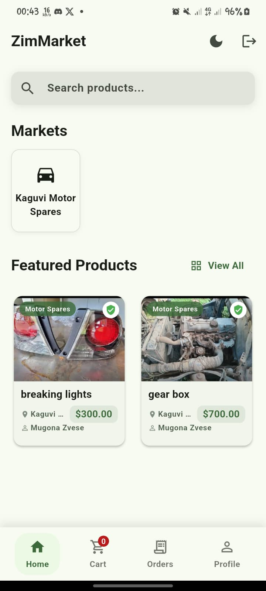
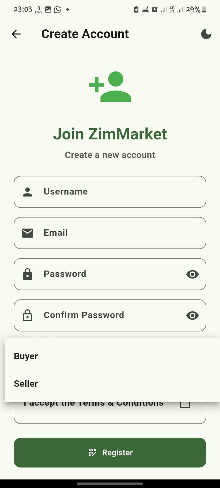

# ZimMarket - Digital Marketplace

A Flutter marketplace app with Supabase backend and Paynow payment processing.

## Features

- User authentication (login, register, forgot password)
- Role-based access (buyer, seller, admin)
- Product listings and search
- Shopping cart
- Secure checkout with Paynow payment gateway
- Order history and tracking
- Seller dashboard
- Admin dashboard

## Preview






## Setup Instructions

### 1. Supabase Setup

1. Create a Supabase account at [supabase.com](https://supabase.com)
2. Create a new project
3. Run the SQL commands from `supabase/schema.sql` in the SQL Editor
4. Get your Supabase URL and anonymous key from the API settings
5. Update these values in `lib/services/supabase_service.dart`:
   ```dart
   const String supabaseUrl = 'YOUR_SUPABASE_URL';
   const String supabaseAnonKey = 'YOUR_SUPABASE_ANON_KEY';
   ```

### 2. Paynow Setup

1. Create a Paynow account at [paynow.co.zw](https://www.paynow.co.zw)
2. Get your integration ID and integration key
3. Update these values in `lib/main.dart`:
   ```dart
   // Paynow test integration credentials
   const String paynowIntegrationId = 'YOUR_PAYNOW_INTEGRATION_ID';
   const String paynowIntegrationKey = 'YOUR_PAYNOW_INTEGRATION_KEY';
   const String paynowResultUrl = 'YOUR_RESULT_URL';
   const String paynowReturnUrl = 'YOUR_RETURN_URL';
   ```

### 3. Flutter Setup

1. Make sure you have Flutter installed
2. Clone this repository
3. Run `flutter pub get` to install dependencies
4. Update your configuration values as described above
5. Run the app with `flutter run`

## Project Structure

- `/lib` - Main source code
  - `/models` - Data models
  - `/providers` - State management
  - `/screen` - UI screens
    - `/auth` - Authentication screens
  - `/services` - API services
  - `/widgets` - Reusable UI components

## Technologies Used

- **Frontend**: Flutter
- **Backend**: Supabase
- **Authentication**: Supabase Auth
- **Database**: Supabase PostgreSQL
- **Payment Processing**: Paynow
- **State Management**: Provider

## Development

### Requirements

- Flutter 3.7.2 or higher
- Dart 3.0.0 or higher

### Testing

For testing, use the following credentials:

- **Test Buyer**: buyer1@example.com / password123
- **Test Seller**: seller1@example.com / password123
- **Test Admin**: admin@example.com / admin123

## Deployment

For production deployment:

1. Update the Supabase and Paynow credentials to production values
2. Configure proper result and return URLs for Paynow
3. Build the app with `flutter build apk` or `flutter build ios`

## License

This project is licensed under the MIT License.
